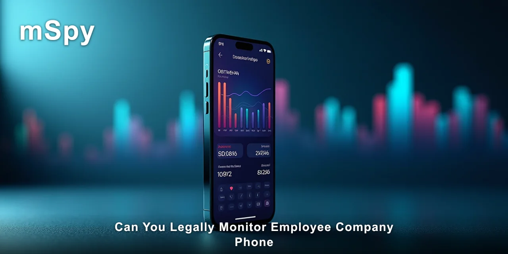
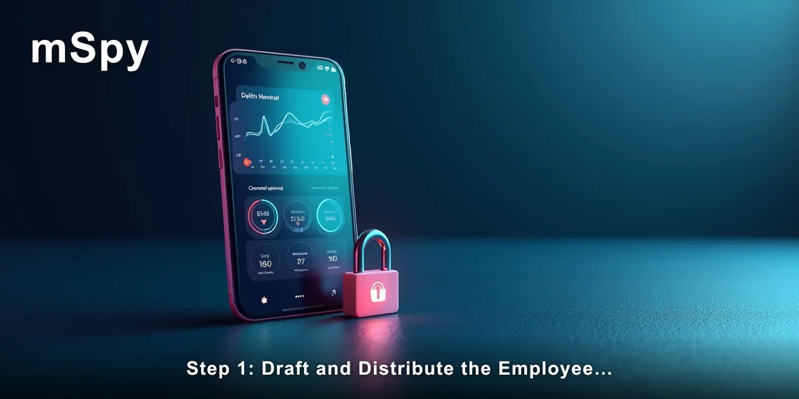

# How to Legally Monitor an Employee Company Phone

Yes, you can legally monitor employee company phone in most jurisdictions, but only under specific conditions tied to consent, policy, and purpose. The short answer: you need a written policy, employee acknowledgement, and a legitimate business reason before any monitoring begins.

This guide walks through the exact steps to set up compliant monitoring using mSpy, including the legal checkpoints and technical setup.

> [!NOTE]
> Quick answer: You can legally monitor employee company phone if you have a written monitoring policy that employees acknowledge, a legitimate business purpose, and you use the device's management features or a compliant monitoring tool. Setup takes about 15 minutes: install the app, configure what data you collect, and verify the control panel.
>
> The result is a dashboard showing calls, texts, GPS location, and app usage tied to that company device.

Most employers I've spoken with assume company ownership alone gives them full access. That's not quite how the law works in practice. The phone might be yours, but the employee's expectation of privacy still matters — which is why the policy and consent steps come before the technical ones.

Most people assume that owning the device means you can watch everything on it with no further steps. The complication is that courts have repeatedly found that employees retain some privacy expectations even on company hardware, especially if no policy exists.

✅ **[mSpy keeps a running record of this activity instead of a single point-in-time snapshot.](https://redirectseo.com/m-en)**

## Contents

- [What You Need Before Starting the Setup](#what-you-need-before-starting-the-setup)
- [Step 1: Draft and Distribute the Employee Monitoring Policy](#step-1-draft-and-distribute-the-employee-monitoring-policy)
- [Step 2: Install the Monitoring App on the Company Device](#step-2-install-the-monitoring-app-on-the-company-device)
- [Step 3: Configure What Data the Monitoring Captures](#step-3-configure-what-data-the-monitoring-captures)
- [Step 4: Review Data and Maintain the Audit Trail](#step-4-review-data-and-maintain-the-audit-trail)
- [Troubleshooting Common Setup Issues](#troubleshooting-common-setup-issues)
- [What You Should See After Completing These Steps](#what-you-should-see-after-completing-these-steps)
- [✅ Fast Recap](#-fast-recap)
- [Frequently Asked Questions](#frequently-asked-questions)

## What You Need Before Starting the Setup

- [ ] A written device and monitoring policy that names the specific data collected
- [ ] Signed acknowledgement from the employee whose phone you'll monitor
- [ ] Physical access to the company phone for about 10 minutes
- [ ] `Android 8` or newer, or an iPhone with iCloud credentials
- [ ] The phone's passcode or unlock pattern

These aren't optional suggestions. Every monitoring method I've seen fail legally has failed at this checklist, not at the software stage. The policy document and the signed form are what separate lawful monitoring from a privacy violation claim.

One observation from working with small business owners: they tend to skip the signed acknowledgement because it feels awkward with long-term staff. That single missing signature is what turns a defensible monitoring program into a liability.

## Step 1: Draft and Distribute the Employee Monitoring Policy

Before any software touches the device, the policy must exist in writing. This step accomplishes the legal foundation that makes can you legally monitor employee company phone a question with a clear yes — but only with this documentation in place.

1. Write a policy that states the company owns the device and that monitoring occurs for business purposes like productivity, data security, and client protection.
2. List the specific data you'll collect: call logs, text messages, GPS location during work hours, app usage, and browser history.
3. State the monitoring hours — continuous or work-hours only — and who has access to the collected data.
4. Have the employee sign an acknowledgement form and keep a copy in their personnel file.

What you'll see after this step: a signed document that names the exact monitoring scope. This is the document you'd show a court or labour board if a dispute arises.

> [!IMPORTANT]
> Do not install any monitoring software before the policy is signed. Installing first and asking for consent later is the single most common reason monitoring programs get ruled unlawful — even when the employer owns the device.

The legal framing here matters more than the technical details. Can you legally monitor employee company phone depends heavily on your jurisdiction — the Electronic Communications Privacy Act in the US, the Data Protection Act 2018 in the UK, and the GDPR across Europe all treat this differently.

The common thread is that written, disclosed, acknowledged monitoring is defensible in every one of these frameworks.

## Step 2: Install the Monitoring App on the Company Device

This step handles the technical deployment. For Android devices, **mSpy** requires a one-time physical installation that takes about 10 minutes. For iPhones, the process works through iCloud backup without installing anything on the target device.

1. On the Android phone, open `Settings → Security → Unknown sources` and enable the toggle to allow app installations outside the Play Store.
2. Download the mSpy APK from the setup link you received after purchase, then open the file to begin installation.
3. Open the installed app and follow the on-screen prompts to grant the required permissions: `Accessibility`, `Notification access`, and `Usage access`.
4. Verify the app is running silently — there's no icon visible on the home screen or app drawer after setup completes.

What you'll see after this step: the app sits hidden on the device, and the control panel at mSpy's website begins showing the phone's basic status — battery level, network connection, and last seen time.

For iPhone monitoring, the process is different. You'll need the employee's iCloud credentials and `iCloud Drive` must be enabled with `Backup` turned on. The setup happens entirely from your browser — no physical access to the phone required beyond the initial credential entry.

> [!TIP]
> Enable `Battery optimization exemption` in `Settings → Apps → Special access` on the Android device. Without this, the operating system may kill the monitoring process in the background and you'll stop receiving data until the app is reopened.

One thing that caught me off guard the first time: the sync delay. It's closer to 15 minutes than real time, especially for `WhatsApp` and `Snapchat` messages. If you're expecting live feeds, adjust your expectations now — the data arrives in batches, not as a live stream.

## Step 3: Configure What Data the Monitoring Captures

Once installed, the control panel gives you granular control over what gets collected. This is where you align the technical setup with the policy document you drafted in Step 1 — only collect what you disclosed.

1. Log into the mSpy web dashboard from any browser on your computer.
2. Open `Dashboard → Settings → Data collection` and toggle each category: `SMS`, `Call history`, `GPS location`, `Browser history`, and `App usage`.
3. Set up geofencing under `Dashboard → Geofences` — define work locations and off-limits areas to get alerts when the device enters or leaves those zones.
4. Enable the keylogger under `Dashboard → Keylogger` if your policy includes keystroke capture, then review the disclosure language to confirm it matches.

What you'll see after this step: the dashboard populates with historical data — the last 30 days of messages, call logs with durations and contact names, and a location history map. The first full sync usually takes about 15 minutes to appear.

The keylogger is the feature that most often crosses the line. Many states and countries treat keystroke capture differently from message logging, and some require an additional disclosure. If your policy doesn't mention it, keep it off.

Can you legally monitor employee company phone with all these features enabled? The answer remains yes if the policy names them specifically. The moment you collect data that isn't in the signed policy, you've stepped outside the legal framework you built in Step 1.

## Step 4: Review Data and Maintain the Audit Trail

Monitoring isn't a set-and-forget activity. The legal protection comes from consistent, documented use that matches the stated purpose.

1. Schedule a weekly review of the dashboard — check for anomalies like off-hours location pings or unusual app usage patterns.
2. Save screenshots or export reports from `Dashboard → Reports` for any incident you act on.
3. Log every access to the monitoring dashboard, including the date, time, and reason for the review.
4. Re-confirm the employee's acknowledgement annually or whenever the policy changes.

What you'll see after this step: a clean audit trail that shows monitoring was consistent, purpose-driven, and within the disclosed scope. This is the documentation that protects you if the employee files a complaint.

In my experience, the employers who get into trouble aren't the ones who monitor — they're the ones who monitor inconsistently or for undisclosed reasons. A manager who checks the dashboard daily for security purposes is in a stronger position than one who checks it only after a dispute starts.

The gap between expectation and reality shows up here most clearly. Most people expect monitoring to be a one-time setup that runs indefinitely. In practice, it's a recurring process that requires the same care as any other HR compliance activity.

## Troubleshooting Common Setup Issues

| Problem | Cause | Fix |
| --- | --- | --- |
| No data appears in the dashboard | The app lost background permission, or the phone has aggressive battery saving | Re-check `Settings → Apps → Special access → Battery optimization` and set the app to "Don't optimise" |
| Messages show up but not call logs | `Call logs` permission was denied during setup | Open `Settings → Apps → mSpy → Permissions` and grant `Phone` access |
| Location updates stop after a few days | The phone's power-saving mode is suspending the GPS service | Disable `Power saving mode` or add the app to the "Never sleeping" list |
| iPhone shows no data after iCloud setup | `iCloud Drive` is disabled or the backup is encrypted with a different password | Verify `Settings → iCloud → iCloud Drive` is on, and confirm the backup password matches |

Most troubleshooting comes down to Android's aggressive background management. The operating system treats long-running background processes as battery drains and suspends them without notification. Every monitoring app faces this, not just this one.

One pattern worth noting: the issues tend to appear after a system update. `Android 14` and `Android 15` both tightened background process limits, so a phone that worked fine for months can stop reporting overnight after an update lands.

It's also worth checking the employee's own habits. If the phone restarts regularly or the employee has a habit of clearing recent apps, the monitoring process may need a manual restart. The app survives reboots, but it doesn't always resume all permissions automatically.

## What You Should See After Completing These Steps

Success looks like a dashboard that updates consistently with the data categories you enabled. You should see recent messages, call logs with timestamps, a location history that matches the employee's known work schedule, and app usage patterns that align with the business purpose you stated in the policy.

To confirm everything works, let the system run for 48 hours before relying on it. The first day often shows gaps because the app is still establishing its background permissions and the device is optimising its battery profile.

- [ ] Dashboard updates at least once every 30 minutes during work hours
- [ ] GPS location history matches known work locations and commute routes
- [ ] Call logs and SMS messages appear for at least the last 48 hours
- [ ] The signed policy acknowledgement is filed and dated

The legal side of this setup is what separates a defensible monitoring program from a liability. Can you legally monitor employee company phone — the answer stays yes as long as your practice matches your policy and your policy states the actual scope of what you collect.

## ✅ Fast Recap

- Written policy and signed acknowledgement come before any software installation
- Android requires physical access for about 10 minutes; iPhone works via iCloud
- Only collect data categories that are named in the signed policy
- Battery optimisation settings are the most common cause of silent monitoring failures
- Sync delay is roughly 15 minutes — not real-time, despite what marketing suggests
- Keep an audit trail of every dashboard access and data review
- Re-confirm employee acknowledgement annually or when policy changes

You now have the full legal and technical picture. The policy is the foundation, the software is the mechanism, and the audit trail is what keeps both defensible.

🔍 **[See the current mSpy plans and features](https://redirectseo.com/m-en)**

## Frequently Asked Questions

### Does this work on iPhone for employee monitoring?

Yes, but through a different mechanism. iPhone monitoring uses iCloud backup rather than a physical install. You'll need the employee's iCloud credentials and `iCloud Drive` enabled with `Backup` turned on. The data pulls from the cloud backup, so it updates more slowly than Android — typically every 15 to 30 minutes.

### Will the employee see any notification that monitoring is active?

No. The app runs with no icon visible on the home screen or app drawer. On Android, it appears as a system process rather than a user app. However, the legally correct approach is that the employee company already knows about the monitoring because they signed the policy — not because the phone shows a notification.

### How long does the full setup take?

About 15 minutes from start to finish. Drafting the policy takes the longest if you don't have one yet — that's the part that takes real thought. The technical installation on Android takes about 10 minutes, and the iOS iCloud setup takes about 5 minutes from your browser.

### Can you legally monitor employee company phone without telling them?

In most jurisdictions, no. Covert monitoring of an employee's company phone is legally risky even when the employer owns the device. Courts have found that employees retain a reasonable expectation of privacy in the content of their communications. The safest path is always disclosure and signed acknowledgement before monitoring begins.

### What data should I avoid collecting even with consent?

Avoid collecting data that isn't job-related: personal health information, private family communications, union activity, and off-duty location data. Even with a signed policy, collecting these categories can violate anti-discrimination laws and privacy statutes. Keep the scope narrow and tied to the business purpose you stated in your policy.